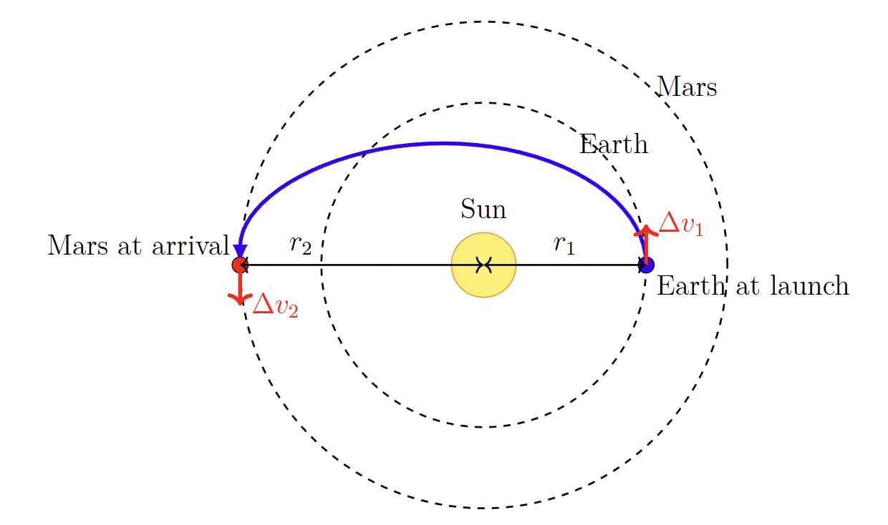
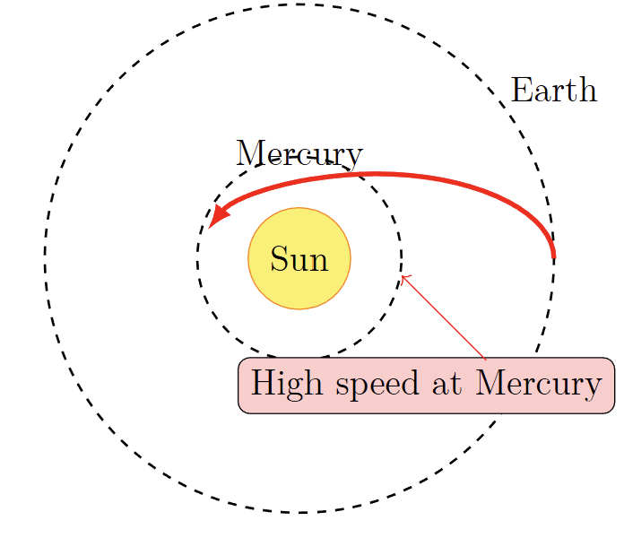

# 项目提案：设计星际高速公路
**面向本科物理的引导性探索**

## 如何使用本文档

本提案将引导您了解星际轨道设计背后的核心理念。每节内容都建立在前一节的基础之上，逐步引入相关概念、数学推导以及真实案例。**问题框**旨在加深您的理解——您可以按照自己的节奏自由探索。最终项目则是您将所有知识应用到现实任务场景中的绝佳机会。

## 1 引言：击中移动目标

向另一颗行星发射探测器，就像是站在一颗旋转的子弹上，试图用另一颗子弹击中一颗同样高速运动的子弹。它的路径并非一条直线，而是穿过太阳系重力井的一条精心选择的弧线。核心挑战在于将地球的运动与目标行星的运动连接起来，并在消耗最少燃料、耗费可接受的时间的前提下实现科学目标。

本项目将介绍其基本物理原理与权衡取舍，从简单的霍曼转移（Hohmann transfers）到前往水星所需的复杂重力助推（gravity-assist）序列。您将看到工程师们是如何以时间换取能量，并利用行星飞掠作为“免费燃料”的。

## 2 基础：霍曼转移

在两个共面的圆形轨道之间移动的最省燃料的方法是**霍曼转移（Hohmann transfer）**[2]——即与两个轨道相切的半个椭圆（图1）。总速度变化量 $\Delta v$（速度增量）决定了所需的燃料；火箭方程表明，燃料随 $\Delta v$ 呈指数增长，因此使其最小化至关重要。

### 数学推导

对于半径为 $r_1$（地球）和 $r_2$（火星）的两个轨道之间的转移，半长轴为 $a = (r_1 + r_2)/2$。所需的点火速度增量为：

$$
\Delta v_1 = \sqrt{\frac{\mu}{r_1}} \left( \sqrt{\frac{2r_2}{r_1 + r_2}} - 1 \right), \quad \Delta v_2 = \sqrt{\frac{\mu}{r_2}} \left( 1 - \sqrt{\frac{2r_1}{r_1 + r_2}} \right)
$$

且转移时间为 $T = \pi \sqrt{a^3/\mu}$（对于火星大约为 8.5 个月）。

> **问题 2.1（猪排图 / Pork-chop plot）**
> 编写一个 Python 脚本，计算地球-火星转移的 $\Delta v$，将其作为发射和到达日期的函数。绘制一个等高线图（猪排图）。您可以使用星历数据或假设轨道为圆形；您可以求解兰伯特问题（Lambert's problem，例如使用 `poliastro` 库）。

## 3 水星的挑战与重力助推

向内侧飞行（前往水星）比向外侧飞行更难。为了从 1 天文单位 (AU) 降到 0.387 AU，航天器必须相对于太阳减速。直接进行霍曼转移会导致极高的到达速度，使得轨道捕获极其消耗燃料（图2）。

> **问题 3.1（向内飞行的成本）**
> 计算从地球到水星霍曼转移的总 $\Delta v$。使用以下数据：$r_E = 1.496 \times 10^8 \text{ km}$， $r_M = 5.791 \times 10^7 \text{ km}$， $\mu_S = 1.327 \times 10^{11} \text{ km}^3/\text{s}^2$。计算相对于水星的到达速度，并将其与水星的轨道速度进行比较。这对入轨（orbital insertion）意味着什么？

### 重力助推

为了节省燃料，航天任务使用**重力助推（gravity assists）**：行星飞掠可以在不消耗燃料的情况下改变航天器相对于太阳的速度。在行星参考系中，航天器的速率保持不变，但行星的运动在太阳参考系中为航天器增加或减少了能量。通过仔细选择飞掠序列，探测器可以在数年内逐渐消耗掉能量。

*案例：*
* **信使号（MESSENGER, NASA）** 在 6.5 年内进行了一次地球、两次金星和三次水星飞掠。
* **贝皮可伦坡号（BepiColombo, ESA/JAXA）** 使用了更长的序列，包括多次金星和水星飞掠，外加电力推进。

> **问题 3.2（设计飞掠序列）**
> 为水星任务提出一个重力助推序列（例如，地球 → 金星 → 金星 → 水星 → 水星）。定性地勾勒出此类多重飞掠轨道的猪排图 $\Delta v$ 等高线可能是什么样子。

## 4 现代工具与最终项目

如今的轨道设计依赖于数值积分、优化算法（如遗传算法、粒子群算法）以及诸如 NASA 的 GMAT 或开源的 `poliastro` 等工具。人工智能正开始在自主导航和实时轨道修正中发挥作用。

### 最终项目：寻找前往水星的发射窗口

**目标：** 调查在 2026 年至 2040 年间是否存在可行的发射窗口，以将探测器送入环绕水星的轨道。将您的发现与实际的信使号（MESSENGER）和贝皮可伦坡号（BepiColombo）任务进行比较。

**需要考虑的约束条件：**
* **运载火箭能力**（例如，阿丽亚娜5型级别：超出地球逃逸速度约 3.5 km/s）。
* **航天器 $\Delta v$ 预算**（通常 1.5 km/s 用于入轨和修正）。
* **最大任务时长**（例如，10年）。
* **最终轨道**（例如，水星低高度极轨道）。
* **真实的行星位置**（使用 2026–2040 年的星历数据）。

在一份简短的报告中展示您的发现，包括关键计算过程、确定的窗口（或说明为什么没有），并与现有的任务进行比较。强调您的推理过程及其中涉及的权衡取舍。

---

## 致谢

灵感源自马雄峰教授以及太空探索的历史。感谢大型语言模型 (LLMs) 在文献回顾和完善本文档时提供的协助。

## 参考文献

1. Prussing, J. E., & Conway, B. A. (1993). *Orbital Mechanics*. Oxford University Press.
2. Hohmann, W. (1925). *Die Erreichbarkeit der Himmelskörper*. Oldenbourg.
3. McAdams, J. V., et al. (2007). “MESSENGER Mission Design and Navigation.” *Space Science Reviews*.
4. Benkhoff, J., et al. (2010). “BepiColombo—Comprehensive exploration of Mercury.” *Planetary and Space Science*.